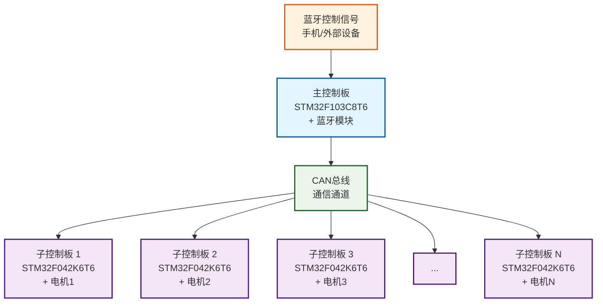
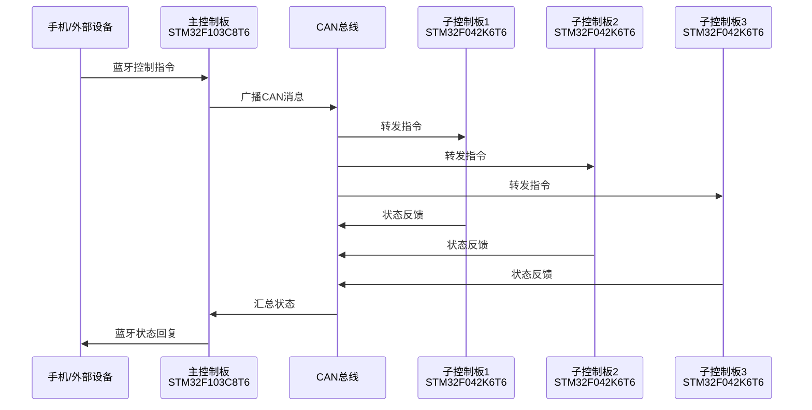
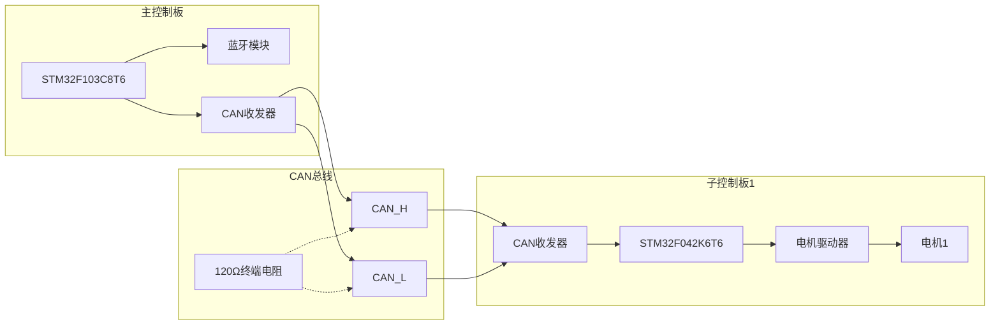

# Motor Control System Flowchart

## System Architecture Flowchart

```mermaid
graph TB
    %% Main Controller
    A[主控制板<br/>STM32F103C8T6<br/>+ 蓝牙模块] --> B[CAN总线<br/>通信通道]
    
    %% CAN Bus Connections
    B --> C[子控制板 1<br/>STM32F042K6T6<br/>+ 电机1]
    B --> D[子控制板 2<br/>STM32F042K6T6<br/>+ 电机2]
    B --> E[子控制板 3<br/>STM32F042K6T6<br/>+ 电机3]
    B --> F[...]
    B --> G[子控制板 N<br/>STM32F042K6T6<br/>+ 电机N]
    
    %% External Control
    H[蓝牙控制信号<br/>手机/外部设备] --> A
    
    %% Styling
    classDef masterClass fill:#e1f5fe,stroke:#01579b,stroke-width:2px
    classDef slaveClass fill:#f3e5f5,stroke:#4a148c,stroke-width:2px
    classDef busClass fill:#e8f5e8,stroke:#1b5e20,stroke-width:2px
    classDef externalClass fill:#fff3e0,stroke:#e65100,stroke-width:2px
    
    class A masterClass
    class B busClass
    class C,D,E,F,G slaveClass
    class H externalClass
```

## Detailed Communication Flow

```mermaid
sequenceDiagram
    participant Phone as 手机/外部设备
    participant Master as 主控制板<br/>STM32F103C8T6
    participant CAN as CAN总线
    participant Slave1 as 子控制板1<br/>STM32F042K6T6
    participant Slave2 as 子控制板2<br/>STM32F042K6T6
    participant Slave3 as 子控制板3<br/>STM32F042K6T6
    
    Phone->>Master: 蓝牙控制指令
    Master->>CAN: 广播CAN消息
    CAN->>Slave1: 转发指令
    CAN->>Slave2: 转发指令
    CAN->>Slave3: 转发指令
    
    Slave1->>CAN: 状态反馈
    Slave2->>CAN: 状态反馈
    Slave3->>CAN: 状态反馈
    CAN->>Master: 汇总状态
    Master->>Phone: 蓝牙状态回复
```

## Hardware Connection Diagram

```mermaid
graph LR
    subgraph "主控制板"
        A1[STM32F103C8T6]
        A2[蓝牙模块]
        A3[CAN收发器]
    end
    
    subgraph "CAN总线"
        B1[CAN_H]
        B2[CAN_L]
        B3[120Ω终端电阻]
    end
    
    subgraph "子控制板1"
        C1[STM32F042K6T6]
        C2[CAN收发器]
        C3[电机驱动器]
        C4[电机1]
    end
    
    A1 --> A2
    A1 --> A3
    A3 --> B1
    A3 --> B2
    B1 --> C2
    B2 --> C2
    C2 --> C1
    C1 --> C3
    C3 --> C4
    B3 -.-> B1
    B3 -.-> B2
``` 