# Mermaid Diagram Guide

Mermaid is a JavaScript-based diagramming tool that renders text-based descriptions into diagrams. It's perfect for documenting system architecture, flowcharts, and logic flows.

## Basic Syntax

All Mermaid diagrams start with a code block marked with `mermaid`:

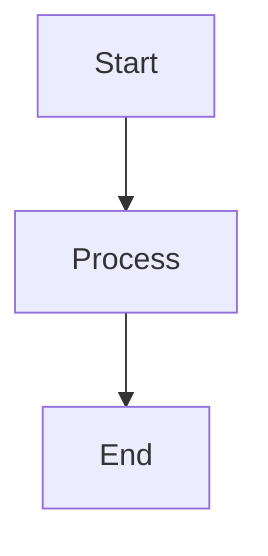

## Common Diagram Types

### 1. Flowcharts (Graphs)

Flowcharts are the most common type, used for process flows and decision trees.

#### Basic Flowchart
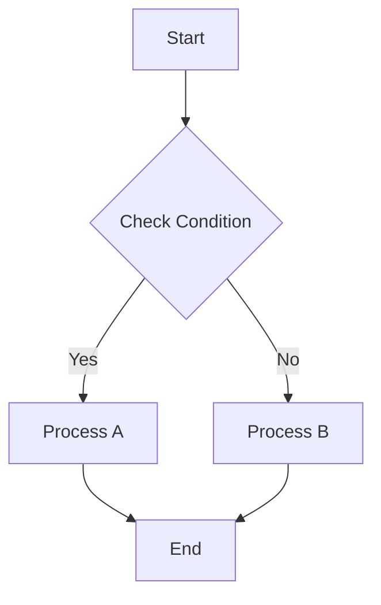

#### Motor Control Flowchart Example
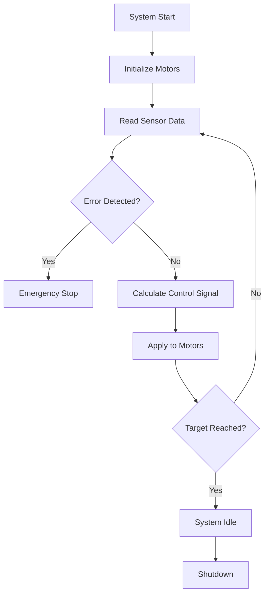

### 2. Sequence Diagrams

Show interactions between components over time.

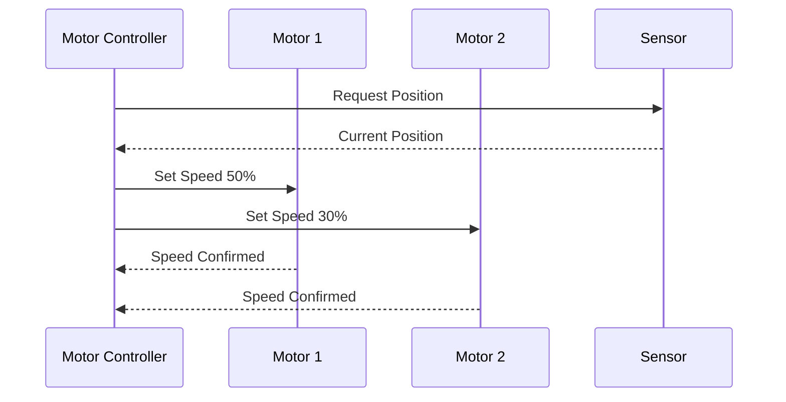

### 3. Class Diagrams

Show object relationships and structure.

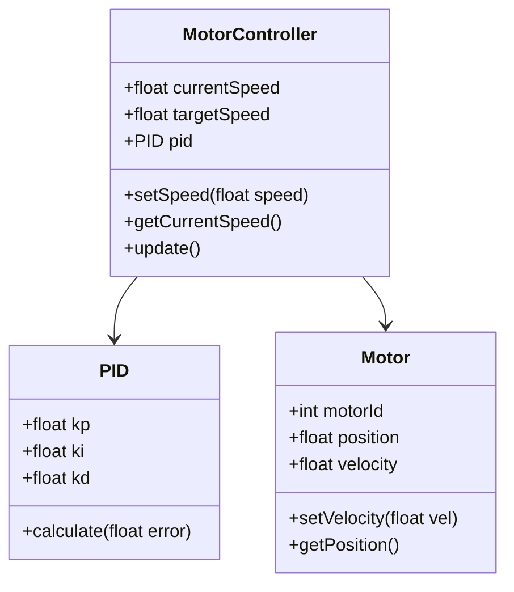

### 4. State Diagrams

Show system states and transitions.

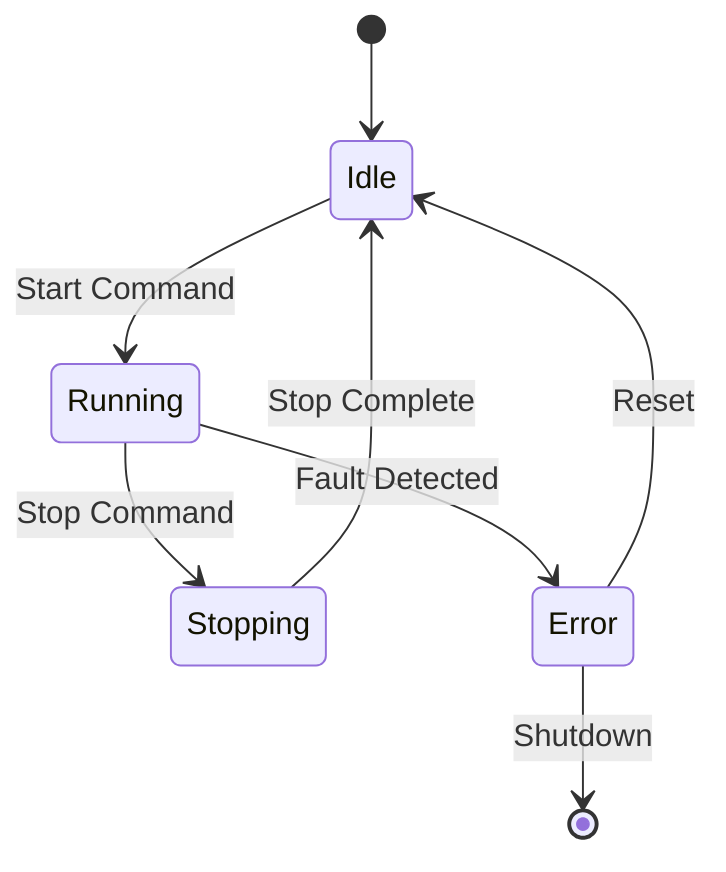

### 5. Entity Relationship Diagrams

Show data relationships.

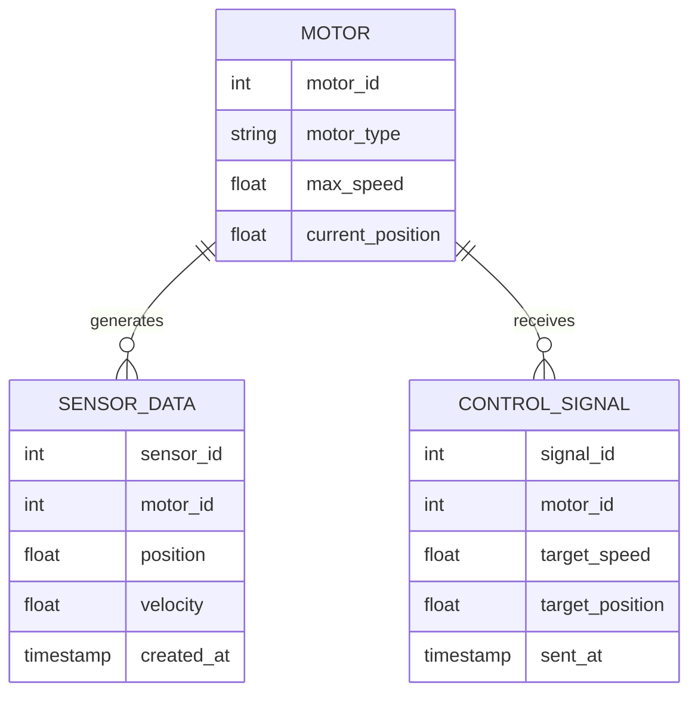

## Advanced Features

### Styling
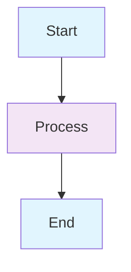

### Subgraphs
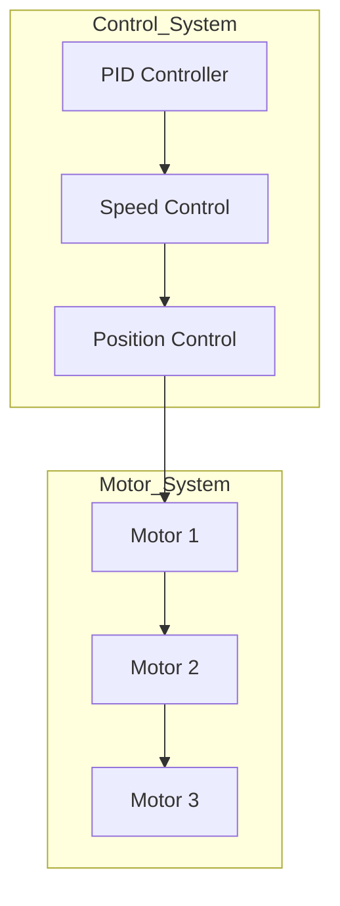

### Links and Comments
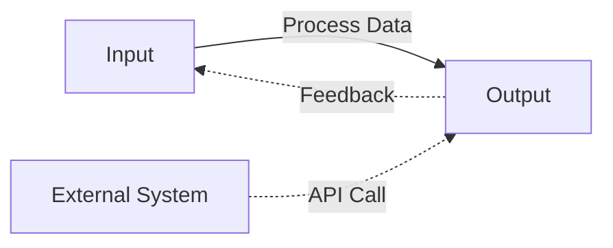

## Motor Control System Example

Here's a comprehensive example for your motor control system:

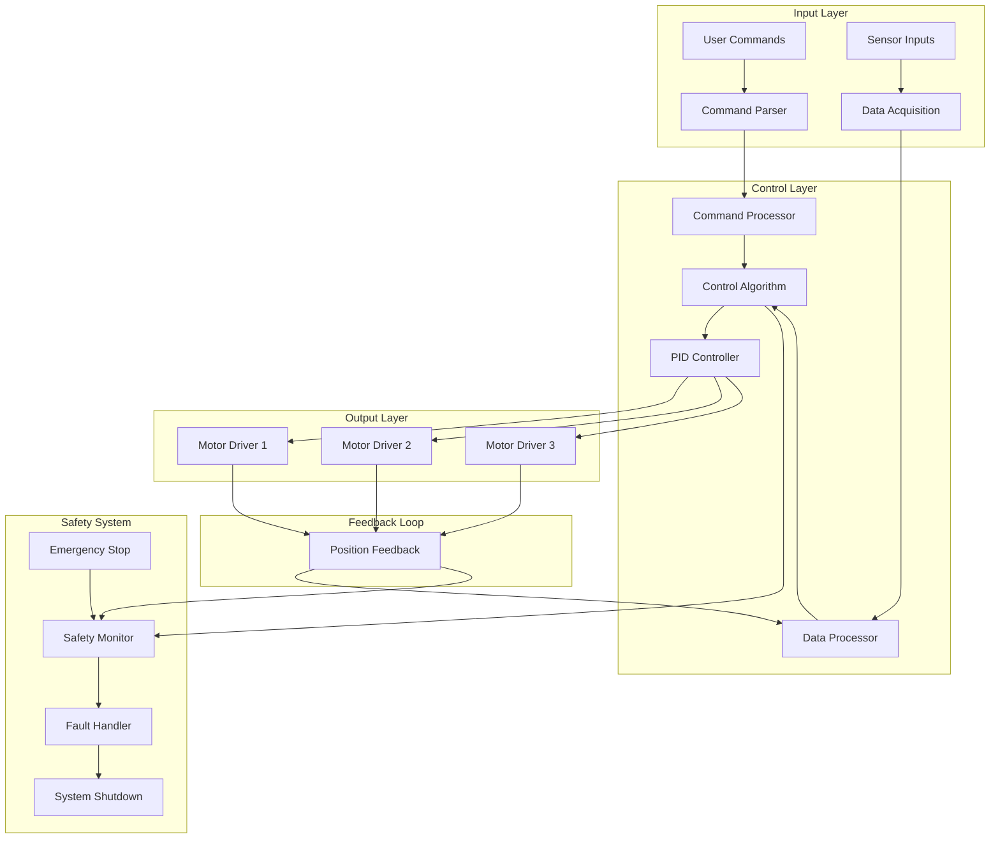

## Tips for Writing Mermaid

1. **Start Simple**: Begin with basic flowcharts before moving to complex diagrams
2. **Use Meaningful Names**: Make node names descriptive
3. **Group Related Elements**: Use subgraphs to organize related components
4. **Add Comments**: Use `%%` for comments to explain complex logic
5. **Test Incrementally**: Build diagrams step by step to catch syntax errors early
6. **Use Consistent Styling**: Apply consistent colors and shapes for similar elements

## Common Syntax Elements

### Node Shapes
- `[]` - Rectangle (default)
- `()` - Rounded rectangle
- `{}` - Diamond (for decisions)
- `(())` - Circle
- `[[]]` - Stadium shape
- `[[]]` - Subroutine shape

### Arrow Types
- `-->` - Solid arrow
- `-.->` - Dotted arrow
- `==>` - Thick arrow
- `--o` - Circle end
- `--x` - Cross end

### Directions
- `TD` - Top to Down
- `BT` - Bottom to Top
- `LR` - Left to Right
- `RL` - Right to Left

This guide should help you create effective diagrams for documenting your motor control system logic and architecture!
